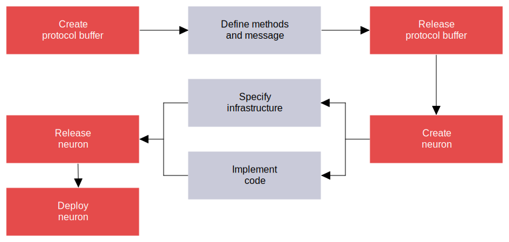

# Overview

**alis.exchange** enables individuals and organisations to move from simply writing code to building enterprise-grade software. 
In this section we provide an overview of the process to build products on **alis.exchange**. A product on **alis.exchange** is what is 
offered to the world and consists of one or more underlying services which provide the functionality of the product. 

In this overview, it is the building of these underlying services which we are interested in. The high-level process that is followed
when creating services are depicted below.

Each of the steps are explained in the following sections and follow the structure: 
- Overview of the step;  
- 👨‍💻 **User actions** - the actions that are required from the user; 
- 🏗 **alis.exchange** - what is facilitated by us in the background; and 

> ‼️ The build example provides detailed steps for the user actions where this section aims to communicate the high-level overview of what would be done.

## Create protocol buffer

Protocol buffers (proto) is the cornerstone of what we build on **alis.exchange**. Creating the proto is the starting point for building out the functionality for your product.

#### 👨‍💻 User actions
Simply run the `alis proto create` command from the terminal.

#### 🏗 alis.exchange
In the background, **alis.exchange** creates a protocol buffer resource within the product and provides a boilerplate proto file which is to be defined in the following step. 

## Define methods and message

Defining the methods and messages in the proto is one of the most important aspects of the build process as itserves as the source of truth for the functionality of the products. The [Resource-oriented design](../../references/resource-oriented-design.md) pattern is widely adopted and provide detailed guidelines as to how to approach the definitions.

#### 👨‍💻 User actions

The user is required to flesh out the proto, and should be consistent with [Google's API Improvement Proposals](https://google.aip.dev/1). Various tooling, such as linters, exists to aid this process.

The primary questions that developers aim to answer during this step is:

1. What are the resources that we are considering? These will be translated into the `messages` in the proto. 
_eg. In the asset management space this may be a `porfolio` and `holdings`._
2. What are the potential relationships and hierarchy between the resources? 
_eg. `portfolio` is the parent of `holdings`._
3. What operations are to be performed? These will be translated into the `methods` of the proto, housed in a `service`. 
_eg. [Standard methods](https://google.aip.dev/131) such as `CreatePortfolio`, `UpdatePortfolio` or [custom methods](https://google.aip.dev/136) such as `CheckPortfolioCompliance`._

Since the protos sit within a version control repo, multiple developers may collaborate and iterate on the proto design. Once the proto is defined and ready to be implemented, it can the be `released`.

## Release protocol buffer

Releasing a protocol buffer is a big thing in our world. It communicates that the current state of the proto is the source of truth. In other words, it is what should be implemented on your side and what clients can expect to consume. There is a lot that also happens in the background which we will unpack in the following section.

#### 👨‍💻 User actions
Simply run the `alis proto release` command from the terminal.

#### 🏗 alis.exchange
The release of the proto automatically kicks off a lot of processes on **alis.exchange** which includes:

- Auto-generating internal and client facing client libraries for a range of supported languages (currently Go, Python and JavaScript). This allows for easy implementation of the methods and allows clients to easily consume your services in their own development environment.
- Auto-configuring API gateways for the services specified in the protos. This provides HTTP endpoints for the gRPC methods, allowing for traditional REST calls to be made to the endpoints.
- Auto-generating documentation for your product directly from your proto definitions. An example can be seen at: 

This single source of truth also sets the foundation for additional auto-generated aspects, which is discussed in the following sections.

## Create neuron

A neuron is simply a unit of compute which consists of a set of cloud infrastructure and, in most cases, some form of code implementation. The cloud infrastructure is specified using Terraform and the code implementation may be done in any language.

#### 👨‍💻 User actions
Simply run the `alis neuron create` command from the terminal and follow the prompts.

#### 🏗 alis.exchange
In the background, **alis.exchange** will provide prepopulated Terraform files based on the neuron requirements. Furthermore, code template files are also available and uses a templating engine along with the latest protocol buffer release to auto-generate server implementation code in the supported languages.

## Specify infrastructure

The Terraform files define the required infrastructure needs that will be applied in the respective cloud environments.

#### 👨‍💻 User actions
When creating the neuron, **alis.exchange** provided a set of Terraform files. These can either be customised or additional specifications may added based on the needs of your implementation. The [documentation on the Terraform site](https://registry.terraform.io/providers/hashicorp/google/latest/docs) serve as an excellent reference for this.

#### 🏗 alis.exchange
The **alis.exchange** CLI has the command available `alis gen terraform` which is able to generate commonly used Terraform specs out of the box. 

## Implement code

In the majority of cases, there is some form of code implementation which realises the methods defined in protocol buffer, referred to as the implementation of the server. In this step, one effectively builds out the APIs to process the request, execute logic in the code and return a response. 

#### 👨‍💻 User actions
1. Using either the auto-generated template files or own custom files, implement the logic of the protocol buffers by using the auto-generated client libraries.
2. If necessary, customise the `Dockerfile` to ensure that the containerisation of the code will be correct.

#### 🏗 alis.exchange
The **alis.exchange** CLI has the command available `alis gen code` which is able to generate files in various languages.

## Release neuron

Releasing a neuron does two primary things:
1. It tags the latest committed state of the infrastructure specification for the neuron, which will be applied to the environment on deploy.
2. The neuron code is containerised and the image is saved in the Cloud.

#### 👨‍💻 User actions
Simply run the `alis neuron release` command from the terminal and follow the prompts.

#### 🏗 alis.exchange
The tagging of the infrastructure is facilitated by us. Furthermore, **alis.exchange** looks for one or more Dockerfile in the neuron's repos which are then built on [Cloud Build](https://cloud.google.com/build).

## Deploy neuron

The deployment of the neuron applies the infrastructure specification to a specified deployment environment(s) (eg. staging or production). A typical example of the outcome would be that a deployment environment has:
- A fully managed instance of the neuron's containerised code ([Cloud Run](https://cloud.google.com/run) instance) which provides clients a means of accessing it's methods.
- A [Cloud BigTable NoSQL database](https://cloud.google.com/bigtable), or other form of storage, which stores information about the resources.
- A [PubSub](https://cloud.google.com/pubsub) topic to which messages are published when certain resources are interacted with.

#### 👨‍💻 User actions
Simply run the `alis neuron deploy` command from the terminal and follow the prompts.

#### 🏗 alis.exchange
Using the tag that was added when releasing the neuron, the infrastructure specification is applied in the deployment environment specified. 

With the former example, this would result in:
- Creating a new Cloud Run instance that hosts the container from the `release` step;
- Adding the various environmental variables to the instance;
- Creating a new BigTable table with the specified table design; and
- Creating a new topic in PubSub with the various policies required.

Leveraging Terraform allows developers to only care about correctly defining the specification, **alis.exchange** will facilitate the implementation thereof.

## Experience it for yourself

We are advocates of learning by doing and are currently working on a comprehensive build example. In the mean time, [schedule a demo](https://alis.exchange/signup) by filling out the form and we will take you through the process.

